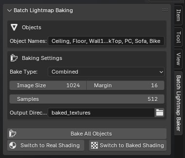
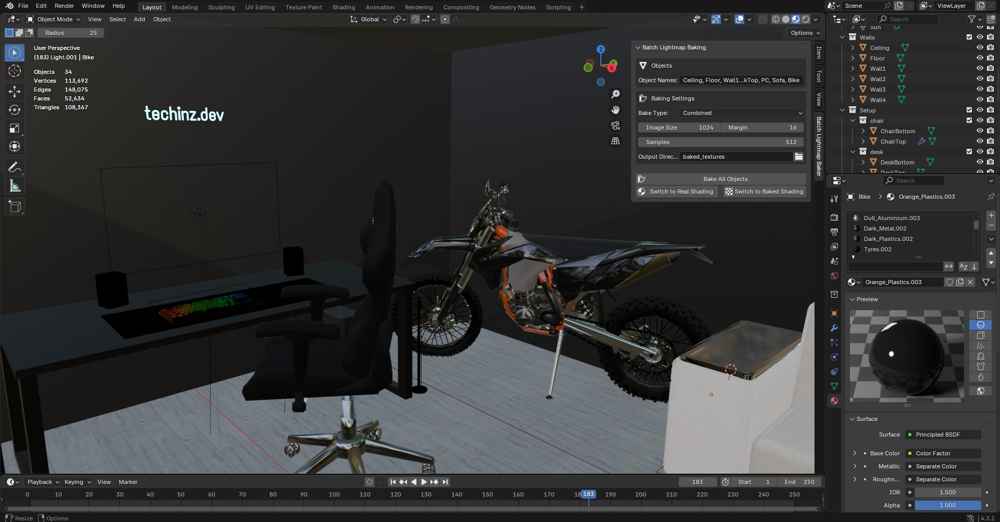
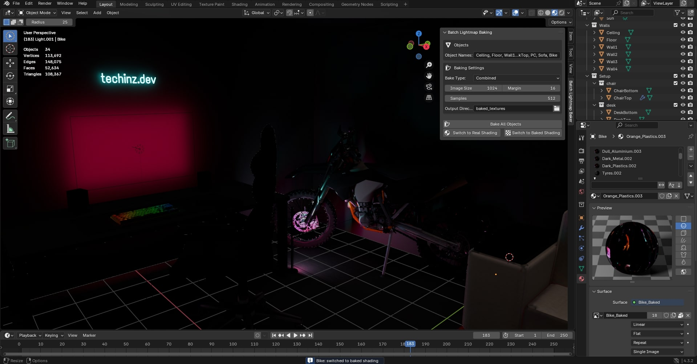
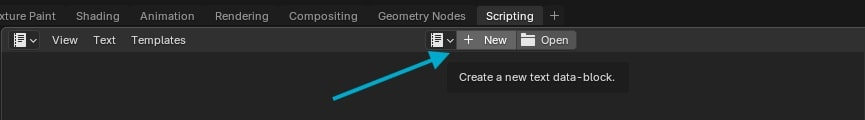
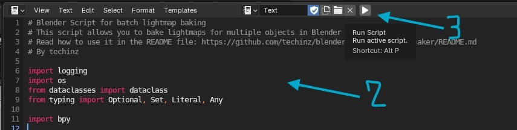
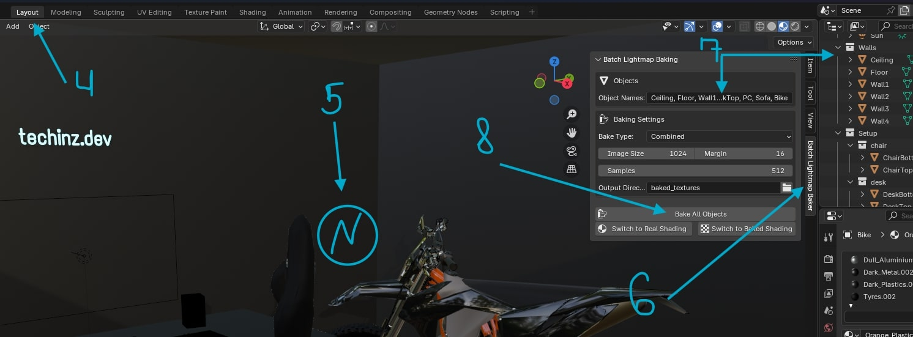

# Blender Batch Lightmap Baker

A lightweight Blender script for effortlessly batch baking lightmaps across multiple objects. Perfect for game artists and threejs developers who need to quickly bake lighting texture without the tedium of doing each object individually.  

## Example Results

Before baking (Real Shading) | After baking (Baked Shading)
:-------------------------:|:-------------------------:
 | 

## Why I Created This

I built this tool while working on my [Galaxy 3D Portfolio](https://github.com/techinz/galaxy-portfolio) project. The process of baking lights one-by-one for each object in my scene was taking hours of repetitive work. I searched for solutions but could only find paid alternatives.

So I created this script to automate the process, which ended up reducing my baking workflow from hours to minutes. The performance gains were substantial - in Three.js, switching from real-time lights to baked lightmaps improved my frame rates by approximately 3-4x on desktop and up to 5x on mobile devices. For GLB optimization specifically, baked lightmaps allowed me to remove several dynamic lights, reducing my final GLB file size by about 15% while simultaneously improving visual quality and performance.

## Features

- 🚀 **Batch Processing** - Bake lightmaps for multiple objects with one click
- 🔄 **One-Click Switching** - Toggle between real-time and baked lighting with one click
- 🔍 **Smart UV Handling** - Auto-creates UV maps for objects that don't have them
- ⚙️ **Flexible Configuration** - Customize resolution, samples, margin, and output location
- 💾 **Automated Export** - Automatically saves baked textures to your specified folder
- 🎯 **Multiple Bake Types** - Choose between Combined, Diffuse, and Glossy baking
- 🧠 **Smart Shader Management** - Preserves original material connections when switching to baked mode and restores them when switching back

## Installation

This is a **script** (not an addon) that runs directly in Blender:

1. Copy the `lightmap_baker.py` file's content
2. Open Blender and go to the "Scripting" tab
3. Insert the file's content
4. Press "Run Script"
5. Go to "Layout" tab and press N. The "Batch Lightmap Baker" tab will appear in your 3D view sidebar

Or

1. Download the `lightmap_baker.py` file
2. Open Blender and go to the "Scripting" tab
3. Click "Open" and select the downloaded script
4. Press "Run Script"
5. Go to "Layout" tab and press N. The "Batch Lightmap Baker" tab will appear in your 3D view sidebar

## How to Use

    
❓ <b>All steps</b>

    

        <h4>1. Open Blender and go to the "Scripting" tab</h4>
        
        <h4>2. Insert the file's content</h4>
        <h4>3. Press "Run Script"</h4>
        
        <h4>4. Go to "Layout" tab</h4>
        <h4>5. Press N</h4>
        <h4>6. Select "Batch Lightmap Baker" tab in your 3D view sidebar</h4>
        <h4>7. Enter comma-separated names of objects to bake (and change other settings if needed)</h4>
        <h4>8. Click "Bake All Objects" Button</h4>
        
    

  

1. **Select Objects**: Enter comma-separated names of objects to bake
2. **Configure Settings**:
   - Set image size for the baked texture
   - Adjust sample count for render quality
   - Set margin to avoid texture bleeding
   - Choose output directory for saved textures
3. **Start Baking**: Click "Bake All Objects" and wait for the process to complete
4. **Switch Modes**: Toggle between real-time and baked lighting using the buttons
   - When switching to baked mode, the script stores your original material connections
   - When switching back to real shading, it automatically restores those connections

## Tips for Best Results

- Make sure objects have proper UV unwrapping (or let the script create basic ones)
- For game assets, use square power-of-two textures (512, 1024, 2048)
- Set an appropriate margin based on your texture resolution (higher res = higher margin)
- Ensure your scene has proper lighting before baking

## Support & Contribution

If you find this script useful, consider giving it a star ⭐! 

Found a bug or have an idea for improvement? Open an issue or submit a pull request.

## License

MIT License - Feel free to use in personal and commercial projects.